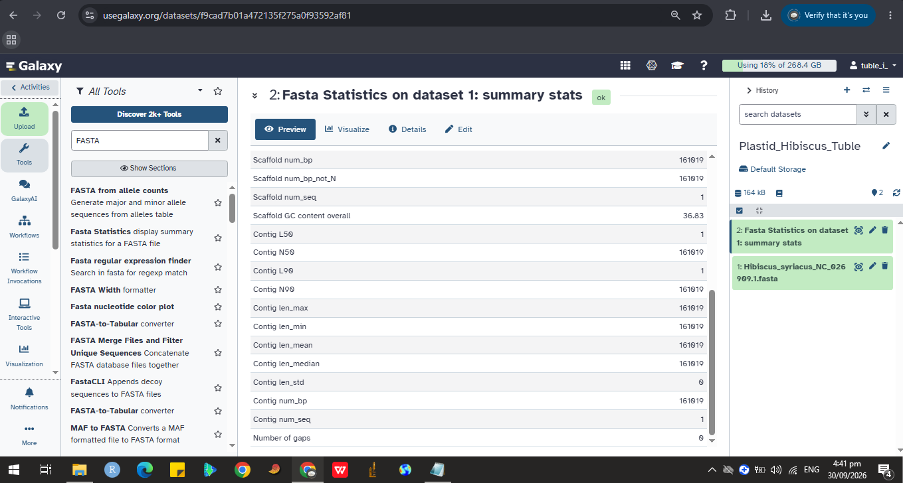

# # Plastid Genome Characterization: Hibiscus syriacus

**Student:** Isabella Tuble

**Course/Section:** Cell and Molecular Biology, A

## Organism and data source
- **Genus / species:** *Hibiscus syriacus* L.
- **Family:** Malvaceae
- **NCBI accession/version:** NC_026909.1 (RefSeq, provisional; identical to GenBank KP688069)
- **Source link:** https://www.ncbi.nlm.nih.gov/nuccore/NC_026909.1
- **Date retrieved:** September 30,2026
- **Genome report:** *The complete chloroplast genome sequence of Hibiscus syriacus*, Mitochondrial DNA Part A 27(5), 2016, doi:10.3109/19401736.2015.1079847

## Plastome summary
| Item | Value |
|---|---|
| Genome size | 161,019 bp |
| Topology | Circular, 1 sequence record |
| GC content | 36.83% (Galaxy) |
| LSC / SSC / IR (each) | 89,698 bp / 19,831 bp / 25,745 bp (from the genome report) |
| Protein-coding genes | 78 unique (RefSeq feature table) |
| tRNA genes | 21 (RefSeq feature table) |
| rRNA genes | not annotated in the feature table; 4 listed in the genome report |
| Introns | *clpP* and *ycf3* (two each); *rps16*, *atpF*, *rpoC1*, *petB*, *petD*, *rpl16*, *rpl2*, *ndhA*, *ndhB* (one each); *trnK-UUU*, *trnL-UAA*, *trnV-UAC* |
| Pseudogenes | none annotated |
| Other notable features | trans-spliced *rps12*; RNA editing flagged for *ndhD* |

The full summary table and gene lists are in `results/plastome_summary.md`.

## How the data were obtained
1. Searched NCBI Nucleotide for *Hibiscus syriacus* chloroplast complete genome.
2. Opened NC_026909.1 and downloaded the complete record as FASTA and as GenBank (full). Both files are in `data/`.
3. Uploaded the FASTA to my own usegalaxy.org account.

## Galaxy analysis
- **History name:** Plastid_Hibiscus_Tuble
- **Dataset name:** Hibiscus_syriacus_NC_026909.1.fasta
- **Tool used:** Fasta Statistics
- **Results:** 1 sequence, 161,019 bp, GC 36.83%, 0 N bases, 0 gaps (output in `results/galaxy_statistics.txt`)

## Gene content and observations
The genome has the usual LSC-IR-SSC-IR structure and a full set of photosystem (*psa*, *psb*), ATP synthase (*atp*), cytochrome b6f (*pet*), RNA polymerase (*rpo*), ribosomal protein (*rps*, *rpl*) and NADH dehydrogenase (*ndh*) genes, plus *rbcL*, *matK*, *clpP*, *accD*, *cemA* and *ycf* genes. It is AT-rich (63.17% A+T). The RefSeq feature table is incomplete: it lists no rRNA genes and annotates only one copy of most inverted-repeat genes, so my counts are lower than the totals in the genome report. I explain this in `report/report.md`.

## Repository contents
- `data/`: FASTA and GenBank files and a source note
- `results/`: summary table and Galaxy output
- `figures/`: Galaxy screenshot
- `report/report.md`: final report (Questions 1-10 and the plastid vs mitochondrial comparison table)

## How to repeat this analysis
1. Download NC_026909.1 from NCBI as FASTA and GenBank (full).
2. Upload the FASTA to Galaxy, run Fasta Statistics, and record the length, number of records and GC content.
3. Count genes, tRNAs and introns from the GenBank features, then compare with the report.

## References
- NCBI RefSeq record NC_026909.1: https://www.ncbi.nlm.nih.gov/nuccore/NC_026909.1
- Galaxy: https://usegalaxy.org
- The full reference list is in `report/report.md`
